# AvixAux
> An Android application with a RESTful web service based on spring boot

## Usage

- Import the project to your ide (eg. IntelliJ)
- Edit base_url in app/src/main/java/com/gi3/avisaux/service/UtilisateurService.java with the ip of the interface connected to the emulator (run the android emulator and see ```ifconfig or ipconfig(on windows)``` )
- Run the server : ```cd server && gradle bootRun```
- Run the app on the emulator
    
## Screenshots

<p align="center">
	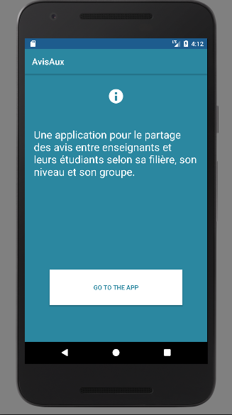
	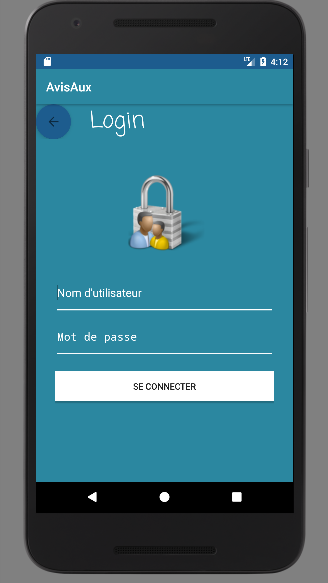
	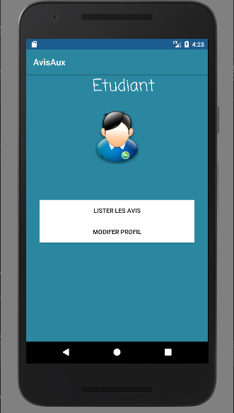
	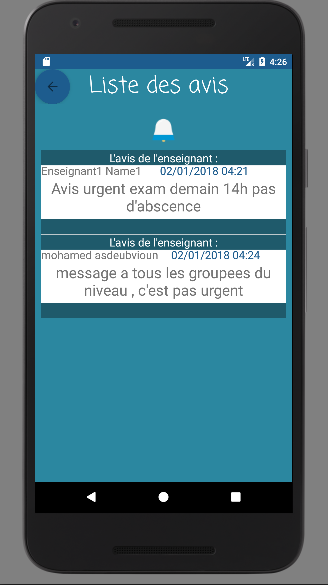
	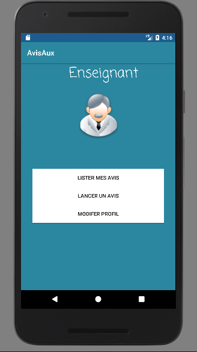
	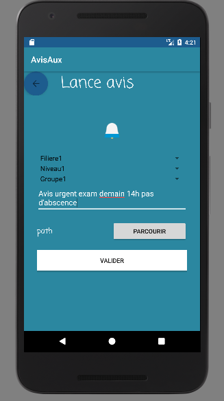
	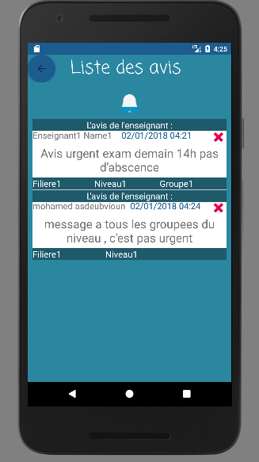
	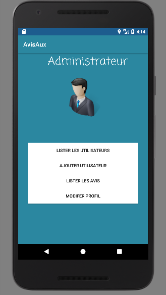
	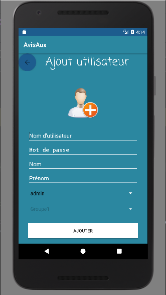
	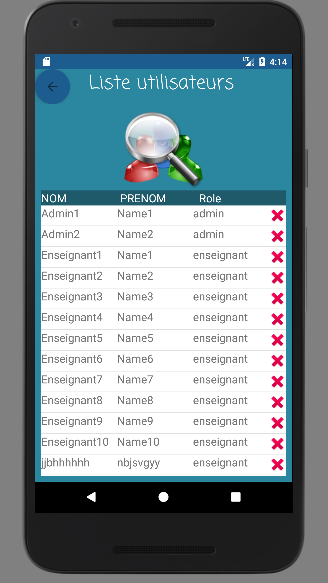
	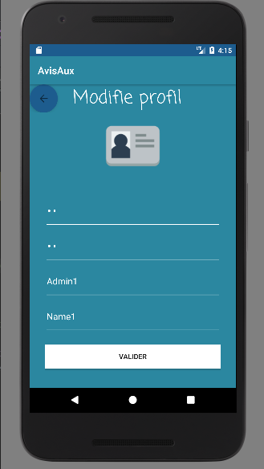
</p>

